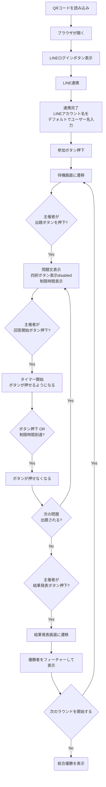

# overview

このドキュメントでは、このプロジェクトで作りたいものを書く。
某オールに感謝するゲーム。

## ユーザーストーリー

### 準備

1. 主催者は管理画面にログインする
2. ゲームを作成するを押す
3. ラウンドを作成するを押す
4. 問題を作成するを押す
5. 問題文、選択肢を編集する
   a. 選択肢を追加削除できる
   b. 制限時間を変更できる
   c. 問題、選択肢それぞれにメディアも設定できる
   d. 並べ替えられる
6. 保存するを押す
7. ラウンドを保存する
8. ゲームを保存する
9. ゲームを開始するを押す
10. QR コードやリンクをコピーする

### プレイの流れ

1. QA コードを読み込んだらブラウザが開く
2. LINE でログインボタンがあるので連携する
3. 連携が完了したら、LINE のアカウント名をデフォルトとしてユーザー名が入力できる
4. 参加ボタンを押したら待機画面に遷移する
5. 参加者が揃ったら、主催者はゲームを開始するボタンを押下する
6. 最初のラウンドが開始する
7. 主催者が出題ボタンを押したら、問題文と四択ボタン (disabled) と制限時間が表示される
8. 主催者が回答開始ボタンを押したら、タイマーが開始しボタンが押せるようになる8. ボタンを押下するか制限時間に達した場合、ボタンが押せなくなる9. 次の問題が出題されたら 5 に戻る。
9. 主催者が結果発表ボタンを押下したらラウンドの結果発表に遷移する
10. ラウンド結果発表は下位から下から表示されていき、トップ3はゆっくり表示され優勝者はフィーチャーされて表示される
11. 主催者は次のラウンドボタンを押下するか、最終結果発表ボタンを押下すると遷移する
12. 最終結果発表

チャート

### 画面の個数

管理画面、主催画面、参加画面

#### 管理画面

ゲームの作成、編集、作成、進行が行える画面

#### 主催画面

プロジェクターや大画面で表示するような画面を想定、各問題やラウンド、ゲームの結果発表、進行状況を表示する

#### 参加画面

参加者が実際に回答する画面

### ゲーム、ラウンド、問題について

包含関係がある。

#### ゲーム

開催単位のこと。ゲーム開始→終了で、参加→最終勝者決定までが行える。

#### ラウンド

ゲーム内で複数回行われるサブセット。例えば特定のテーマにフォーカスしたりする。
ラウンド内でも集計が行われ、その回の勝者を出すことも可能。

#### 問題

複数の選択肢から選べる早押しクイズのこと。
